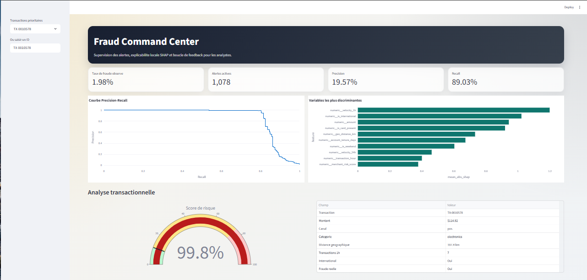
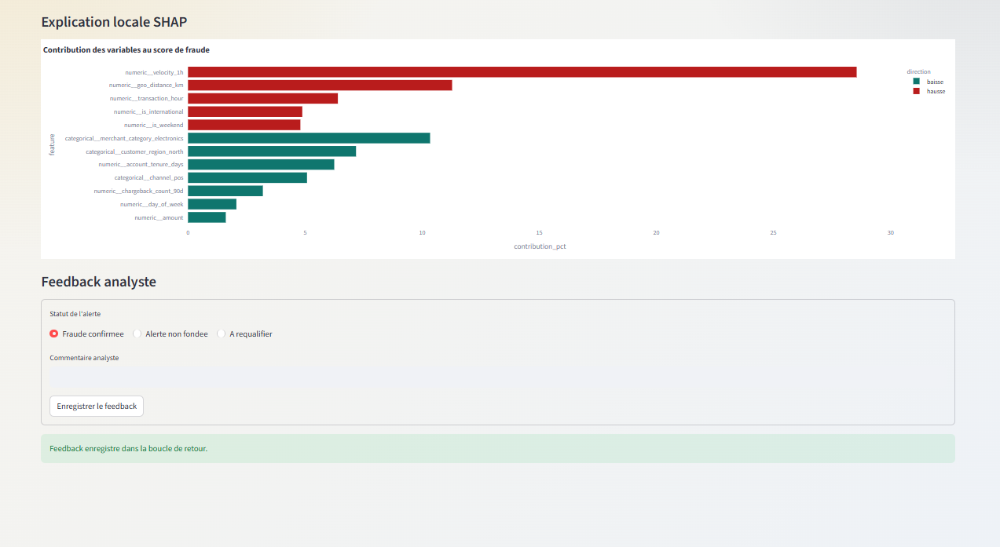
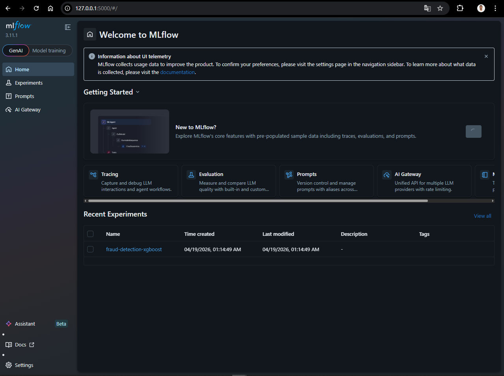
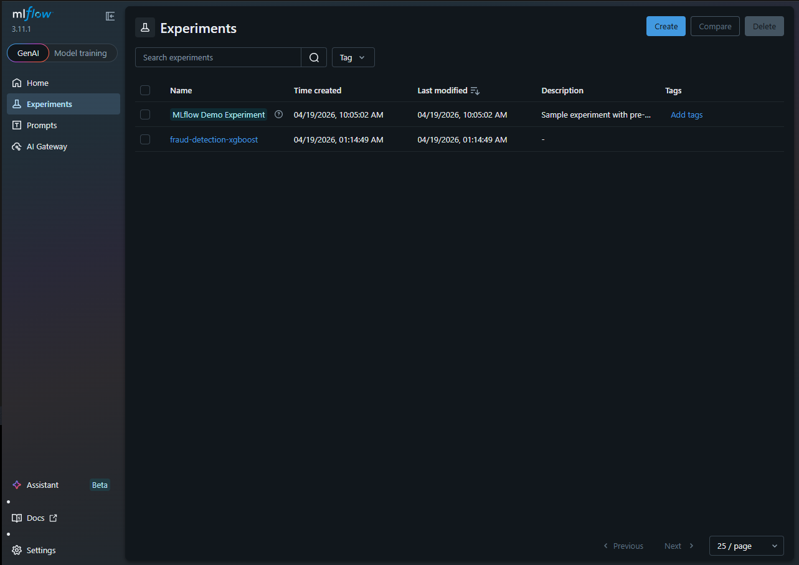

💳 Fraud Detection System

Ce projet propose un système de détection de fraude bancaire basé sur des techniques de machine learning. Il permet d’analyser des transactions financières, d’identifier les opérations suspectes et de fournir des outils d’aide à la décision pour les analystes.

🎯 Objectifs
Détecter efficacement les transactions frauduleuses
Gérer le déséquilibre des données (fraudes rares)
Fournir des explications interprétables du modèle
Offrir une interface simple pour l’analyse des résultats

🛠️ Stack technique
Modélisation : XGBoost
Gestion du déséquilibre : SMOTE + scale_pos_weight
Suivi des expériences : MLflow
Explicabilité : SHAP
Interface utilisateur : Streamlit

📁 Organisation du projet
fraud_detection_system/
│
├── app/                     # Interface Streamlit
├── artifacts/               # Modèles et fichiers générés
├── configs/                 # Paramètres du projet
├── data/                    # Données (raw, processed, feedback)
├── scripts/                 # Scripts (génération, entraînement)
├── src/                     # Code source principal
└── tests/                   # Tests
⚙️ Installation
python -m venv .venv
.\.venv\Scripts\activate
pip install -r requirements.txt

🚀 Exécution
1. Générer des données (si nécessaire)
python scripts/generate_demo_data.py
2. Entraîner le modèle
python scripts/train_model.py
3. Lancer le dashboard
streamlit run app/streamlit_app.py
4. Visualiser les expériences MLflow
mlflow ui --backend-store-uri mlruns
📊 Résultats

L’entraînement produit plusieurs fichiers dans artifacts/ :
fraud_model.joblib : modèle entraîné
metrics.json : performances du modèle
scored_transactions.csv : transactions avec score
test_scored_transactions.csv : données de test scorées
precision_recall_curve.csv : données pour courbe PR
📈 Dashboard

Le dashboard permet :
Suivi des indicateurs (précision, rappel, volume d’alertes)
Analyse détaillée d’une transaction
Explication des décisions du modèle avec SHAP
Visualisation de l’importance des variables
Ajout de feedback analyste pour amélioration continue

## 📊 Aperçu de l'Interface (Fraud Command Center)
Le système intègre un dashboard Streamlit permettant aux analystes de superviser les transactions suspectes en temps réel.

### 🔍 Explicabilité & Feedback (SHAP)
Chaque prédiction est accompagnée d'une explication locale (SHAP) pour identifier les facteurs de risque (ex: vitesse de transaction, localisation). Une boucle de feedback permet à l'analyste de requalifier la fraude.

## 🧪 Suivi des Expériences avec MLflow
Le pipeline MLOps utilise MLflow pour le tracking des versions du modèle et des métriques de performance.

⚠️ Remarques
Un dataset de démonstration est généré automatiquement si aucun fichier n’est présent
Le seuil de décision est configurable dans configs/train_config.yaml
Le modèle est optimisé pour limiter les faux négatifs (fraudes non détectées)